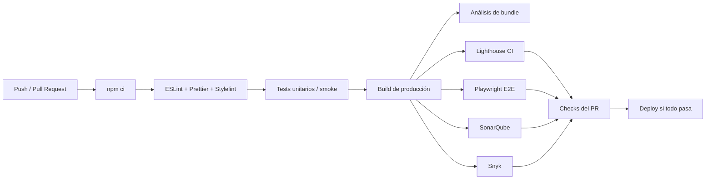
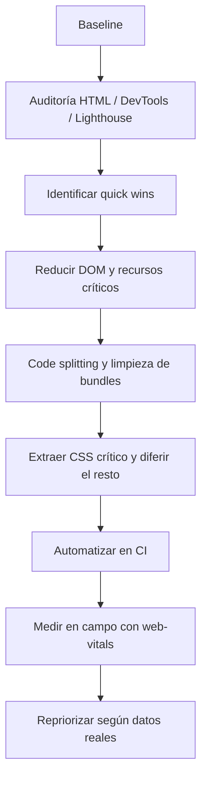

# Informe analítico sobre optimización y simplificación de código HTML y JavaScript para una aplicación web

## Resumen ejecutivo

Sin especificación de repo, framework o bundler, la estrategia más sólida es **agnóstica al stack**: primero medir, después fijar presupuestos, luego reducir la carga crítica inicial y, por último, automatizar regresiones. En la práctica, las mejoras con mejor relación impacto/esfuerzo suelen ser: **priorizar el recurso LCP en el HTML**, **reducir y trocear el JavaScript inicial**, **diferir CSS y JS no críticos**, **recortar el DOM inicial** y **meter gates automáticos en CI** con Lighthouse CI, linting y pruebas E2E. citeturn14search9turn22search9turn24search19turn25search2turn12search3

Las métricas clave deben evaluarse **en laboratorio y en campo**, y leerse sobre el **percentil 75** por dispositivo. Como referencia operativa: **LCP ≤ 2,5 s**, **CLS ≤ 0,1**, **INP ≤ 200 ms** y **TTFB ≤ 0,8 s** como guía práctica; para laboratorio, **TBT** es una buena señal de bloqueo del hilo principal y una aproximación útil a problemas de capacidad de respuesta, aunque no sustituye al INP real. citeturn26search6turn26search11turn26search9turn14search1turn14search15turn26search10turn26search14

Para un repo real, la optimización sostenible no consiste solo en “hacer más pequeña la web”, sino en **hacer el código más predecible, más medible y menos propenso a regresiones**. Eso implica unir rendimiento, accesibilidad y mantenibilidad en el mismo flujo: **ESLint + Prettier + Stylelint** para consistencia, **SonarQube** para complejidad/duplicación/deuda, **Dependabot y Snyk** para dependencias, y **Playwright/Lighthouse CI** para evitar que una mejora local rompa otra parte del sistema. citeturn36search5turn36search8turn6search1turn25search1turn25search4turn25search11turn20search4turn6search2turn6search6turn7search0turn29search0

La recomendación más práctica, si hoy no tienes ningún sistema montado, es esta: **baseline inicial → quick wins en HTML/LCP → reducción de JS inicial → presupuestos de bundle → automatización en PR → RUM en producción**. Ese orden minimiza riesgo y maximiza retorno.

## Objetivos y métricas clave

La tabla siguiente resume qué conviene medir, qué objetivo usar y con qué herramientas automatizarlo. Los umbrales de Web Vitals y PageSpeed/CrUX se leen al percentil 75; las métricas de mantenibilidad proceden de SonarQube; y bundle size/parseo deben tratarse como **presupuestos del proyecto**, no como absolutos universales. citeturn26search6turn26search11turn26search9turn14search1turn14search15turn14search17turn25search1turn25search4turn25search11turn26search12turn33search18

| Área | Qué medir | Objetivo práctico | Cómo medir y automatizar |
|---|---|---|---|
| Carga percibida | **LCP** | ≤ 2,5 s | Lighthouse, PageSpeed Insights, CrUX, `web-vitals` en producción |
| Estabilidad visual | **CLS** | ≤ 0,1 | Lighthouse, CrUX, `web-vitals`, revisión de imágenes/fuentes/ads |
| Respuesta a interacción | **INP** | ≤ 200 ms | `web-vitals` en campo; en lab usar flujos reales + TBT como proxy |
| Backend / documento inicial | **TTFB** | ≤ 0,8 s como guía | PageSpeed/CrUX, WebPageTest, Server-Timing, logs del backend |
| Bloqueo del hilo principal | **TBT** y long tasks | Minimizar tareas > 50 ms | Lighthouse + DevTools Performance |
| Payload JS | **Bundle size por ruta** | Presupuesto por tipo de recurso y ruta crítica | Source Map Explorer, Bundlephobia, budgets de Lighthouse/LHCI |
| Coste de parse/eval | **Script evaluation / main-thread work** | Bajar tiempo total y picos | DevTools Performance, Insights, flame charts |
| Complejidad de la UI | **DOM nodes, listeners, recalculados de estilo** | DOM inicial pequeño y estable | DevTools Performance Monitor y auditoría de DOM |
| Accesibilidad | **Errores a11y y contraste** | Cero blockers, score alto, navegación teclado correcta | Lighthouse, DevTools CSS Overview, revisión manual |
| Mantenibilidad | **Complejidad, duplicación, deuda técnica, lint errors** | Tendencia descendente; gates en código nuevo | SonarQube, ESLint, Stylelint, Prettier |

Una nota importante: **TTI ya no forma parte de Lighthouse** desde Lighthouse 10; hoy es mejor trabajar con **LCP, TBT e INP**. citeturn26search7

## Técnicas prácticas para HTML y JavaScript

### HTML

La primera palanca de optimización en HTML es la **semántica correcta**. HTML define estructura y significado; cuanto más use el documento elementos nativos adecuados —`header`, `main`, `nav`, `section`, `button`, `form`, `label`, `img`— menos trabajo tendrás que hacer después con accesibilidad, scripts y CSS. Además, la primera regla de ARIA sigue siendo válida: **si un elemento nativo resuelve el problema, úsalo antes que añadir roles y estados ARIA por encima**. citeturn15search12turn15search8turn9search7turn15search18

La segunda palanca es **reducir el DOM inicial**. Lighthouse marca como problema un DOM excesivo y recomienda crear nodos solo cuando se necesiten y destruirlos cuando ya no aporten valor. En una SPA esto suele traducirse en: no renderizar paneles ocultos al arrancar, no duplicar carouseles/accordions fuera de pantalla y virtualizar listados largos si aparecen cientos o miles de filas. citeturn25search2turn25search3

La tercera es **lazy loading bien aplicado**. `loading="lazy"` en imágenes fuera de pantalla reduce peticiones innecesarias y acorta la ruta crítica, pero **no debe aplicarse a la imagen LCP**, porque retrasa su descubrimiento y empeora directamente el LCP. En otras palabras: lazy para contenido offscreen; prioridad alta para el recurso principal del viewport. citeturn9search0turn15search5turn9search13turn9search12

La cuarta es **hacer visible el recurso principal cuanto antes**. Para ello conviene: dejar el recurso LCP descubrible en el HTML, usar `preload` con criterio para imágenes/fuentes críticas y, cuando proceda, `fetchpriority="high"` en la imagen principal. También ayuda extraer e incrustar **critical CSS** del contenido above the fold y diferir el CSS no crítico. El matiz importante es no abusar de `preload`, especialmente con fuentes, porque puede competir con otros recursos críticos. citeturn14search9turn9search1turn9search24turn9search5turn24search4turn24search7turn24search19turn9search9

La quinta es **evitar CLS desde el propio marcado**. Lo mínimo es: declarar `width` y `height` o reservar espacio para imágenes, embeds e iframes; no introducir contenido por encima del contenido ya pintado; y vigilar fuentes web con `preload` y ajustes de fallback cuando sea necesario. citeturn9search5turn9search21

La sexta es **asegurar el viewport correcto**. El `meta viewport` no es un detalle cosmético: Lighthouse lo audita porque afecta a cómo el navegador dimensiona y escala la página en móvil. Debe estar en el documento base y no dejarse a plantillas incompletas o landings heredadas. citeturn9search6

La séptima es **reducir estilos inline innecesarios**. MDN recomienda definir estilos en archivos separados; el atributo `style` tiene más sentido para pruebas rápidas o casos muy puntuales. Llevar estilos a CSS o a un sistema de diseño mejora caché, legibilidad, reutilización, diff en PRs y capacidad de automatizar limpieza con PostCSS/Stylelint/PurgeCSS. citeturn24search0turn24search9

### JavaScript

La primera decisión importante en JavaScript es **usar ESM y scripts módulo**. Los módulos permiten imports explícitos, facilitan tree-shaking y cargan con semántica más predecible; además, **los scripts `type="module"` ya son defer por defecto**, mientras que en scripts clásicos `defer` y `async` tienen comportamientos distintos y deben elegirse según dependencias y orden de ejecución. citeturn15search7turn15search3turn22search14turn22search22

La segunda es **trocear el JavaScript**. El code splitting mediante `import()` reduce el payload de arranque y mueve el coste de parseo/ejecución a momentos en los que realmente se necesita una funcionalidad. Es especialmente rentable en rutas secundarias, widgets pesados, mapas, editores, charts y modales complejos. citeturn22search0turn22search9turn22search21

La tercera es **hacer tree-shaking real**, no solo “usar un bundler”. El tree-shaking funciona mejor con ESM y imports granulares; CommonJS tiende a dificultar la eliminación estática de código muerto. En términos prácticos: importa solo lo que usas, evita barrels inflados cuando perjudiquen la poda y revisa dependencias grandes antes de instalarlas. citeturn22search1turn22search7turn19search6

La cuarta es **minimizar trabajo del hilo principal**. Si el navegador pasa mucho tiempo parseando, evaluando o ejecutando JS, suben TBT e INP. El objetivo es romper long tasks, reducir librerías innecesarias, retrasar módulos secundarios y mover cómputo pesado fuera del main thread. DevTools Performance, Lighthouse y la documentación de Web Vitals son bastante explícitos en este punto. citeturn14search17turn26search14turn23search17

La quinta es **reducir reflows y trabajo de layout**. Activadores típicos: handlers de `scroll`/`resize` demasiado frecuentes, lecturas de layout seguidas de escrituras DOM, y árboles DOM sobredimensionados. En la práctica: agrupa lecturas y escrituras, aplica `debounce` o `throttle` a eventos ruidosos, evita recalcular UI completa por pequeños cambios y usa `transform/opacity` en animaciones cuando sea posible. citeturn23search0turn23search1turn23search4turn25search3

La sexta es **evitar memory leaks**. Las pistas clásicas son listeners no eliminados, timers vivos tras desmontar componentes, referencias a nodos ya retirados y crecimiento progresivo del heap. DevTools Memory, heap snapshots y la vista de elementos “detached” ayudan a detectarlo. En código, conviene centralizar cleanup y usar `AbortController` cuando un listener o un fetch tenga ciclo de vida finito. citeturn23search2turn23search8turn10search5turn23search5

La séptima es **usar Web Workers cuando el problema sea CPU**, no DOM. Si el trabajo es compresión, parsing pesado, scoring, filtros, búsqueda local o generación compleja de datos, un worker puede liberar el hilo principal. Si lo que haces depende del DOM, un worker no resuelve el cuello de botella porque no tiene acceso directo a él. citeturn23search3turn23search6turn23search9

La octava es **caching con intención**. Para activos compilados, usa nombres con hash y políticas de caché largas. Para navegación y repetición de páginas, el **bfcache** es una optimización extremadamente rentable y a menudo olvidada. Y si la aplicación lo justifica, un service worker bien diseñado puede mejorar carga y resiliencia de red, pero no es sustituto de reducir el payload inicial. citeturn14search18turn23search19

## Herramientas recomendadas

La selección siguiente prioriza herramientas **oficiales o primarias**, y cuando existe documentación en español la señalo o la uso como referencia principal.

image_group{"layout":"carousel","aspect_ratio":"16:9","query":["captura informe Lighthouse Chrome DevTools", "captura waterfall WebPageTest"]}

### Medición y diagnóstico

| Herramienta | Propósito | Ventaja principal | Limitación práctica | Comando / uso base | Ejemplo en proyecto | Fuente |
|---|---|---|---|---|---|---|
| Lighthouse | Auditoría de performance, accesibilidad y buenas prácticas | Estándar de facto para lab; integra oportunidades y diagnósticos | No sustituye datos reales de usuarios | `npx lighthouse https://tu-app.com --view` | Ejecutarlo sobre home, login y checkout antes de cada release | citeturn9search2turn14search10 |
| WebPageTest | Diagnóstico profundo con waterfall, vídeo, filmstrip y localizaciones | Muy útil para TTFB, waterfall y variabilidad realista de red | Requiere API key y lectura más técnica | `curl -X POST "https://www.webpagetest.org/runtest.php?url=https://tu-app.com&f=json" -H "X-WPT-API-KEY:$WPT_API_KEY"` | Nightly contra URL pública con comparación histórica | citeturn10search0turn27search0turn27search1 |
| Chrome DevTools | Inspección runtime: Coverage, Performance, Memory, CSS Overview | La mejor herramienta para aislar hotspots concretos | Exige análisis manual experto | Sin CLI; usar Performance, Coverage, Memory y CSS Overview | Revisar JS no usado, heap, reflows y DOM size antes del merge grande | citeturn10search2turn10search3turn25search17turn28search2 |
| PageSpeed Insights + CrUX | Verificación externa y datos de campo públicos | Mezcla lab + field data cuando existe | No sirve para entornos privados ni rutas sin tráfico real | Web UI / API | Comprobar si mejoras locales llegan a datos reales del origen | citeturn13search3turn13search2turn13search6 |
| `web-vitals` | Recoger CWV en producción | Ligero y alineado con la metodología oficial | Requiere canal propio de envío y agregación | `npm i web-vitals` | Enviar LCP/CLS/INP/TTFB a `/rum` o a analytics | citeturn13search0turn13search1turn13search4 |
| Source Map Explorer | Analizar qué ocupa cada byte del bundle | Muy útil para detectar librerías y duplicados | Necesita source maps correctos | `npx source-map-explorer dist/assets/*.js` | Analizar bundle de la ruta principal tras cada build de producción | citeturn30view1 |
| Bundlephobia | Valorar coste de una dependencia antes de instalarla | Ideal para decisiones previas a `npm install` | No analiza tu app real, solo el paquete o `package.json` | Web UI “Scan package.json” | Revisar una librería de charts antes de adoptarla | citeturn19search6turn19search2turn36search2 |

### Build, bundles y CSS

| Herramienta | Propósito | Ventaja principal | Limitación práctica | Comando / uso base | Ejemplo en proyecto | Fuente |
|---|---|---|---|---|---|---|
| Vite | Dev server y build moderno | Configuración simple y build productiva rápida | Algunas necesidades avanzadas exigen plugins/config extra | `npm create vite@latest` / `vite build` | Migrar una app vanilla o SPA a pipeline moderno | citeturn21search10turn21search8turn21search6 |
| Rollup | Bundler especialmente limpio para ESM y librerías | Muy buen tree-shaking y salida controlada | Menos “todo en uno” que Vite/Parcel | `rollup --config` | Generar bundle de librería compartida o widget embebible | citeturn4search0turn35view0 |
| Webpack | Bundler configurable para pipelines complejos | Control explícito de loaders/plugins/salida | Complejidad de configuración | `npx webpack` / `npx webpack --config webpack.config.js` | Monorepo o app con necesidades de compilación muy personalizadas | citeturn21search2turn34view0turn34view2 |
| Parcel | Bundler cero-config | Muy rápido de arrancar y productivo para apps sencillas | Menos explícito cuando necesitas control fino | `parcel src/index.html` / `parcel build src/index.html` | Prototipo o app multipágina sin montar toolchain completa | citeturn4search5turn35view1 |
| esbuild | Bundler/transpilador ultrarrápido | Velocidad sobresaliente para build scripts y tooling | Menos ecosistema “full app” que webpack/vite | `npx esbuild app.ts --bundle --outdir=dist` | Scripts de build auxiliares o empaquetado ligero | citeturn4search6turn21search0 |
| SWC | Compilador/transpilador rápido basado en Rust | Muy buen rendimiento en transpile | A menudo se usa como pieza, no como solución completa | `npx swc ./src -d dist` | Sustituir Babel en parte del pipeline o usar con webpack | citeturn4search3turn16search2turn16search19 |
| PostCSS | Transformación CSS por plugins | Base excelente para autoprefixing, limpieza y normalización | Requiere decidir plugins y política | `npx postcss src.css -o dist.css` | Pipeline CSS con autoprefixer, nesting y minificación | citeturn6search0turn17search0turn17search4 |
| PurgeCSS | Eliminar CSS no usado | Muy rentable en apps con hojas grandes | Hay que proteger clases generadas dinámicamente | `npx purgecss --css dist/*.css --content dist/**/*.html dist/**/*.js --output dist/` | Limpiar CSS heredado tras build | citeturn5search2turn18search0turn18search4 |
| UnCSS | Eliminar CSS no usado a partir de HTML renderizado | Útil cuando tienes HTML representativo ya generado | No sirve bien con templates no renderizados ni interacciones posteriores a carga | `uncss index.html > styles.clean.css` | Auditar landing estática o HTML generado | citeturn30view0 |
| Stylelint | Lint de CSS | Detecta errores y fuerza convenciones | Necesita config adaptada al stack CSS | `npx stylelint "**/*.css"` | Gate de PR para CSS/SCSS/CSS Modules | citeturn6search1turn17search2 |

### Calidad, seguridad, automatización y refactor

| Herramienta | Propósito | Ventaja principal | Limitación práctica | Comando / uso base | Ejemplo en proyecto | Fuente |
|---|---|---|---|---|---|---|
| ESLint | Lint de JS/JSX | Detecta patrones problemáticos y puede autofijar parte | Requiere reglas razonables para no generar ruido | `npx eslint .` / `npx eslint . --fix` | Enforce de `no-var`, `prefer-const`, imports y cleanup | citeturn36search5turn36search0turn36search3 |
| Prettier | Formateo automático | Reduce fricción de estilo y conflictos de formato | No sustituye al lint semántico | `npx prettier . --check` / `npx prettier . --write` | Formato consistente en HTML/CSS/JS antes de commit | citeturn36search8turn36search6 |
| SonarQube | Métricas y revisión estática de calidad/mantenibilidad | Visibilidad de complejidad, duplicación, deuda y calidad gates | Requiere instalación/servicio y afinado de reglas | `sonar-scanner` | Gate de “nuevo código” con complejidad y duplicación | citeturn7search11turn17search3turn25search1 |
| Snyk | Seguridad de dependencias y SAST adicional | Muy útil en CI para dependencias y código | Hay que ajustar umbrales para no bloquear por ruido | `npx snyk test` / `npx snyk monitor` | Fallar build en vulnerabilidades altas | citeturn6search2turn6search6turn6search18 |
| Dependabot | Actualización automática de dependencias | Reduce deuda de versiones y exposición a CVEs | Necesita política de agrupación/frecuencia | `.github/dependabot.yml` | PRs semanales de npm + etiquetas automáticas | citeturn20search4turn20search0turn20search12 |
| Playwright | E2E y automatización del navegador | Muy fuerte en aislamiento, paralelismo y CI | Más peso inicial que scripts ad hoc | `npm init playwright@latest` / `npx playwright test` | Flujos críticos: login, checkout, subida, filtros | citeturn29search3turn29search12turn20search3 |
| Puppeteer | Automatización del navegador por API | Flexible para scraping, scripts y coberturas custom | Menos framework de test integrado que Playwright Test | `npm i puppeteer` | Cobertura JS/CSS o automatización técnica puntual | citeturn18search3turn18search7turn10search8 |
| ts-migrate | Acelerar migración a TypeScript | Útil para migraciones por lotes | Deja `any` y `@ts-expect-error`; requiere remate manual | `npx ts-migrate <folder>` / `npx ts-migrate-full <folder>` | Migración incremental de carpetas compartidas | citeturn32view0 |
| jscodeshift | Codemods sobre AST | Muy potente para refactors repetibles | Hay que escribir y probar transformaciones con cuidado | `npx jscodeshift -t transform.js src` | Reemplazar APIs heredadas, `var`, imports, listeners | citeturn31view0 |

## Flujo de trabajo y CI/CD

Un flujo bueno para este problema tiene cuatro capas. **Local**: lint/format y tests rápidos antes del commit. **PR**: build de producción, análisis de bundles, Lighthouse CI y E2E. **Nightly**: WebPageTest y comparación histórica para URLs públicas. **Producción**: RUM con `web-vitals` y paneles de tendencias. Lighthouse CI está pensado precisamente para ejecutar Lighthouse en cada commit, hacer assertions, subir informes y prevenir regresiones; Playwright tiene CLI y reporters preparados para CI; y el flujo de trabajo de entity["company","GitHub","code hosting platform"] Actions se define en YAML y puede cachear dependencias con `setup-node`. citeturn29search0turn29search1turn29search4turn11search1turn11search2turn7search0turn20search3





### Scripts npm recomendados

Si el stack no está definido, esta es una base razonable con Node/npm. Sustituye `start:ci` por el comando de preview de tu bundler o framework. Las piezas de lint, preprocess y Lighthouse CI están soportadas formalmente por las herramientas oficiales. citeturn36search6turn17search2turn29search0turn29search12

```json
{
  "scripts": {
    "lint:js": "eslint .",
    "lint:css": "stylelint \"**/*.css\"",
    "format:check": "prettier . --check",
    "format:write": "prettier . --write",
    "test:e2e": "playwright test",
    "build": "vite build",
    "preview": "vite preview",
    "start:ci": "vite preview --host 0.0.0.0 --port 4173",
    "analyze:bundle": "source-map-explorer 'dist/assets/*.js'",
    "perf:lhci": "lhci autorun",
    "security:test": "snyk test",
    "security:monitor": "snyk monitor"
  }
}
```

### Pipeline de GitHub Actions

La sintaxis de Actions, el uso de `setup-node`, Playwright y SonarQube están documentados oficialmente. El ejemplo siguiente es deliberadamente genérico: vale para HTML/JS “clásico”, Vite y muchas SPAs si ajustas `build` y `start:ci`. citeturn11search17turn11search1turn20search22turn29search12turn20search2

```yaml
name: quality

on:
  pull_request:
  push:
    branches: [main]

jobs:
  web-quality:
    runs-on: ubuntu-latest
    steps:
      - uses: actions/checkout@v6

      - uses: actions/setup-node@v6
        with:
          node-version: 22
          cache: npm

      - run: npm ci

      - run: npm run lint:js
      - run: npm run lint:css --if-present
      - run: npm run format:check

      - run: npm run build
      - run: npm run analyze:bundle --if-present

      # Sustituye por el preview/start real de tu stack
      - run: npm run start:ci &
      - run: npx wait-on http://127.0.0.1:4173

      - run: npm run perf:lhci
      - run: npm run test:e2e

      # Opcional: seguridad
      # - run: npm run security:test
      #   env:
      #     SNYK_TOKEN: ${{ secrets.SNYK_TOKEN }}

      # Opcional: SonarQube
      # - run: sonar-scanner
      #   env:
      #     SONAR_TOKEN: ${{ secrets.SONAR_TOKEN }}
```

### Hooks pre-commit

Para el pre-commit, la combinación mínima y muy efectiva es **Husky + lint-staged**: Husky crea el hook y `lint-staged` ejecuta acciones solo sobre archivos staged. Es una de las mejores formas de frenar drift de estilo y errores triviales antes de que lleguen al PR. citeturn11search11turn12search1

```bash
npx husky init
```

```json
{
  "lint-staged": {
    "*.{js,jsx,ts,tsx}": ["eslint --fix", "prettier --write"],
    "*.{css,scss}": ["stylelint --fix", "prettier --write"],
    "*.{html,json,md}": ["prettier --write"]
  }
}
```

## Checklist de refactorización y plantillas

### Checklist paso a paso para un repo real

1. **Congela una baseline**: Lighthouse, DevTools Performance/Coverage/Memory y bundle analysis sobre 3 rutas críticas. Guarda capturas e informes.
2. **Haz inventario**: scripts clásicos, third-party JS, CSS global, imágenes sin dimensiones, HTML con inline styles, bloques DOM ocultos de arranque.
3. **Ataca quick wins HTML**: viewport, semántica, landmarks, `loading="lazy"` fuera de viewport, dimensiones de imágenes, hero sin lazy, limpieza de estilos inline.
4. **Ataca quick wins JS**: `defer` o `type="module"`, quitar librerías duplicadas, code splitting por ruta/feature, tree-shaking real, limpiar handlers frecuentes.
5. **Revisa CSS**: critical CSS, diferir CSS no crítico, hallar CSS no usado, safelist de clases dinámicas, contraste y tokens repetidos.
6. **Añade budgets**: bundle por ruta, scripts e imágenes en LHCI, complejidad/duplicación en SonarQube, vulnerabilidades altas en Snyk.
7. **Automatiza CI**: lint, formato, build, LHCI, E2E, seguridad y comentario de PR con métricas.
8. **Mide en producción**: `web-vitals` + panel de tendencias; contrasta con CrUX/PageSpeed si tu origen tiene suficiente tráfico. citeturn29search0turn33search14turn25search1turn13search0turn13search6

### Plantilla de PR recomendada

```md
## Objetivo
- Qué problema resuelve este PR
- Qué rutas afecta

## Cambios principales
- [ ] HTML semántico / landmarks
- [ ] Reducción de DOM
- [ ] Code splitting / lazy loading
- [ ] Limpieza de CSS no usado
- [ ] Refactor de listeners / memoria
- [ ] Actualización de dependencias

## Métricas antes / después
| Métrica | Antes | Después | Delta |
|---|---:|---:|---:|
| LCP |  |  |  |
| CLS |  |  |  |
| TTFB |  |  |  |
| TBT |  |  |  |
| JS inicial transferido |  |  |  |
| JS evaluado |  |  |  |
| DOM nodes iniciales |  |  |  |
| Issues a11y |  |  |  |
| Complejidad / duplicación |  |  |  |

## Riesgos
- Compatibilidad
- Posibles regresiones
- Plan de rollback

## Evidencias
- Capturas de Lighthouse / WebPageTest
- Enlace al job de CI
- Enlace al informe de SonarQube
```

### Snippets y codemods concretos

Los seis ejemplos siguientes cubren exactamente las tareas que más se repiten al simplificar HTML/JS en un repo web.

#### Eliminar inline styles

MDN recomienda mantener estilos en archivos separados; usar clases facilita caché, linting y mantenimiento. citeturn24search0turn24search9

```html
<!-- Antes -->
<button style="padding:12px 16px;background:#111;color:#fff;border-radius:8px">
  Comprar
</button>

<!-- Después -->
<button class="btn btn--primary">Comprar</button>
```

```css
.btn {
  padding: 12px 16px;
  border-radius: 8px;
}

.btn--primary {
  background: #111;
  color: #fff;
}
```

#### Convertir scripts a módulos

Los módulos son más mantenibles y cargan con semántica moderna; `type="module"` ya difiere la ejecución respecto al parseo del documento. citeturn15search3turn15search7turn22search14

```html
<!-- Antes -->
<script src="/js/app.js" defer></script>

<!-- Después -->
<script type="module" src="/js/app.js"></script>
```

```js
// app.js
import { mountCart } from "./cart.js";
import { initSearch } from "./search.js";

mountCart();
initSearch();
```

#### Añadir `loading="lazy"` a imágenes no críticas

Úsalo en imágenes fuera de viewport; no en el recurso LCP. citeturn9search0turn9search13

```html
<!-- Antes -->


<!-- Después -->

```

#### Extraer CSS crítico

Un ejemplo práctico con `critical`, tal como muestra web.dev. Es útil cuando la home o landing tiene above-the-fold muy definido. citeturn33search0turn33search4

```js
// scripts/critical.js
const critical = require("critical");

critical.generate({
  base: "dist/",
  src: "index.html",
  dest: "index.html",
  inline: true,
  dimensions: [
    { width: 360, height: 800 },
    { width: 1366, height: 768 }
  ]
}).then(() => {
  console.log("Critical CSS generado");
});
```

#### Reemplazar `var` por `let/const`

Haz este codemod como primer paso y después pasa ESLint con `prefer-const` para rematar casos seguros. `jscodeshift` está hecho precisamente para este tipo de transformaciones masivas. citeturn31view0turn36search5

```js
// codemods/no-var.js
module.exports = function (file, api) {
  const j = api.jscodeshift;

  return j(file.source)
    .find(j.VariableDeclaration, { kind: "var" })
    .replaceWith(path => j.variableDeclaration("let", path.node.declarations))
    .toSource();
};
```

```bash
npx jscodeshift -t codemods/no-var.js src
npx eslint . --fix
```

#### Simplificar listeners

La delegación de eventos reduce listeners y `AbortController` facilita cleanup. Añade debounce si el evento es ruidoso. citeturn23search0turn23search1turn25search3turn23search2

```js
// Antes: un listener por botón
document.querySelectorAll(".remove-item").forEach(btn => {
  btn.addEventListener("click", onRemoveItem);
});

// Después: delegación + cleanup
const controller = new AbortController();

document.addEventListener("click", (event) => {
  const btn = event.target.closest(".remove-item");
  if (!btn) return;
  onRemoveItem(btn.dataset.id);
}, { signal: controller.signal });

// Cuando desmontes la vista:
controller.abort();
```

## Riesgos, medición y priorización

### Riesgos y mitigaciones

| Riesgo | Cómo aparece | Mitigación recomendada |
|---|---|---|
| Regresión funcional | Un refactor de imports, listeners o CSS rompe flujos secundarios | Playwright en rutas críticas, smoke tests por PR y rollout gradual |
| Breaking change visual | PurgeCSS/UnCSS elimina clases usadas dinámicamente o critical CSS queda incompleto | Safelist, snapshots visuales, revisar SSR/CMS/clases computadas |
| “Mejora” local que empeora el campo | Baja TBT en lab pero no mejora INP/LCP reales | Medir con `web-vitals` y contrastar con CrUX/PageSpeed |
| Falsa optimización | Se reduce bundle pero sube TTFB o complejidad operativa | Evaluar siempre impacto compuesto: TTFB + LCP + TBT/INP + mantenibilidad |
| Deuda de automatización | Reglas o gates demasiado agresivos bloquean al equipo | Empezar con gates suaves en PR y endurecer por fases |

### Qué medir después del refactor

La recolección buena combina tres capas. **Lab por commit/PR**: Lighthouse CI y, si la URL es pública, WebPageTest programado. **Campo en producción**: `web-vitals` enviado a tu backend o herramienta analítica. **Benchmark externo**: CrUX/PageSpeed cuando exista tráfico suficiente. Para dashboards, una combinación muy pragmática es: informe de LHCI en PR, SonarQube para calidad estructural y CrUX Dashboard o Looker Studio para tendencia de campo. citeturn12search3turn27search0turn13search0turn13search6turn13search22turn25search1

Un set mínimo de KPIs de mejora, recogido automáticamente, sería este:

| KPI | Fuente | Frecuencia |
|---|---|---|
| LCP, CLS, TBT, score Lighthouse | LHCI | Cada PR |
| Waterfall, TTFB, filmstrip, WPT Lighthouse | WebPageTest | Nightly / release |
| Bundle por entrada | Source Map Explorer | Cada build de producción |
| Dependencias pesadas nuevas | Bundlephobia | En revisión técnica / PR |
| Complejidad, duplicación, deuda | SonarQube | Cada PR / main |
| Vulnerabilidades | Snyk + Dependabot | Cada PR / semanal |
| LCP, CLS, INP, TTFB reales | `web-vitals` + dashboard | Continuo |

### Plan de priorización por impacto y esfuerzo

Sin conocer stack ni arquitectura, este es un orden razonable para casi cualquier aplicación web:

| Acción | Impacto | Esfuerzo | Prioridad |
|---|---|---|---|
| Quitar lazy del recurso LCP y hacerlo descubrible/prioritario | Muy alto | Bajo | P0 |
| Añadir dimensiones a imágenes/embeds y corregir CLS obvio | Muy alto | Bajo | P0 |
| Activar `type="module"` / `defer` correctamente | Alto | Bajo | P0 |
| Reducir DOM inicial y nodos ocultos que arrancan renderizados | Alto | Medio | P0 |
| Code splitting de rutas, widgets y third-party pesados | Muy alto | Medio | P1 |
| Extraer CSS crítico y diferir CSS no crítico | Alto | Medio | P1 |
| Limpiar CSS no usado con PurgeCSS/UnCSS + revisión manual | Medio | Medio | P1 |
| Sustituir dependencias pesadas tras revisar Bundlephobia/SME | Alto | Medio | P1 |
| Refactor de listeners con delegación/debounce/cleanup | Medio | Bajo | P1 |
| Añadir workers para cálculo CPU pesado | Medio | Alto | P2 |
| Migración incremental a TypeScript con ts-migrate | Medio | Alto | P2 |
| Codemods amplios de estilo/APIs heredadas | Medio | Medio/Alto | P2 |

La idea no es “hacerlo todo”, sino **mover primero lo que toca LCP, DOM inicial y JS de arranque**, porque ahí suelen estar las ganancias más visibles para el usuario. citeturn14search9turn25search2turn23search17

## Referencias prioritarias

- **Lighthouse**: overview, scoring, TBT, auditorías de DOM, server response y accessibility. citeturn9search2turn14search10turn14search17turn25search2turn14search2turn9search14
- **web.dev**: Web Vitals, LCP, INP, TTFB, code splitting, tree shaking, critical CSS, resource hints, long tasks y workers. citeturn14search5turn26search9turn14search15turn14search1turn22search0turn22search1turn24search4turn9search24turn23search17turn23search3
- **MDN de entity["organization","Mozilla","browser foundation"]**: HTML, semántica, ARIA, `script`, módulos, `loading`, viewport y fundamentos de rendimiento. citeturn15search12turn15search8turn9search7turn15search7turn22search14turn15search5turn15search13
- **Chrome DevTools**: Coverage, Performance, Memory, CSS Overview, Performance Monitor. citeturn10search2turn25search17turn10search5turn28search2turn25search3
- **Lighthouse CI**: getting started, configuración y flujo `collect -> assert -> upload`. citeturn12search0turn12search4turn29search4
- **WebPageTest**: getting started, REST API y ejecución de Lighthouse. citeturn28search1turn27search0turn27search1
- **Build tools**: Vite, Rollup, Webpack, Parcel, esbuild y SWC. citeturn21search6turn21search8turn35view0turn34view0turn35view1turn21search0turn16search2
- **Calidad y CSS**: ESLint, Prettier, Stylelint, PostCSS, PurgeCSS, UnCSS. citeturn36search5turn36search6turn17search2turn17search0turn18search0turn30view0
- **Seguridad y dependencia**: Snyk, Dependabot, CodeQL. citeturn6search2turn6search6turn20search4turn20search0turn20search1
- **Automatización y refactor**: Playwright, Puppeteer, ts-migrate y jscodeshift. citeturn29search12turn18search7turn32view0turn31view0