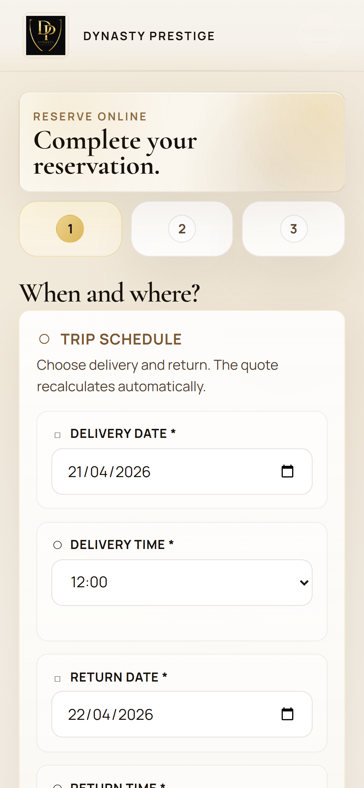
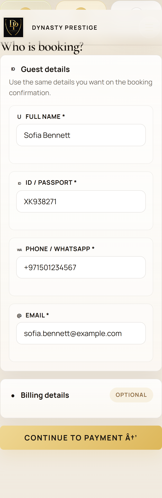
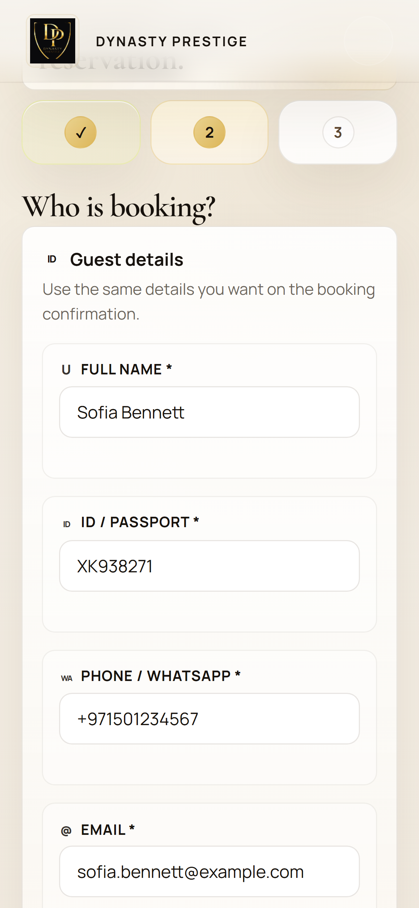
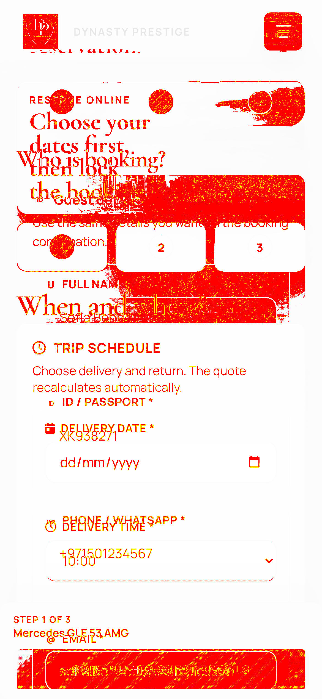
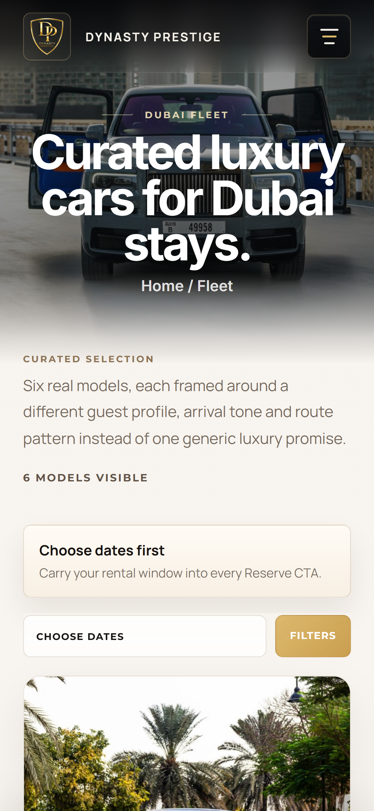
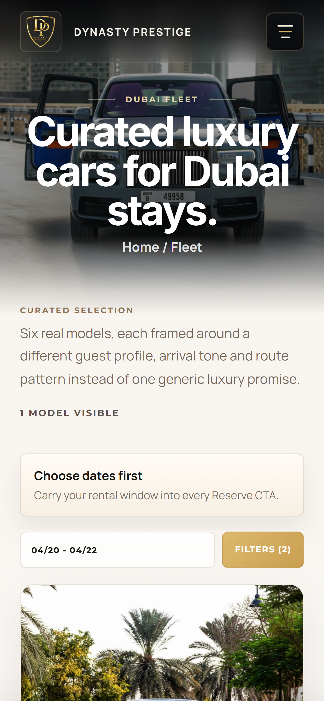
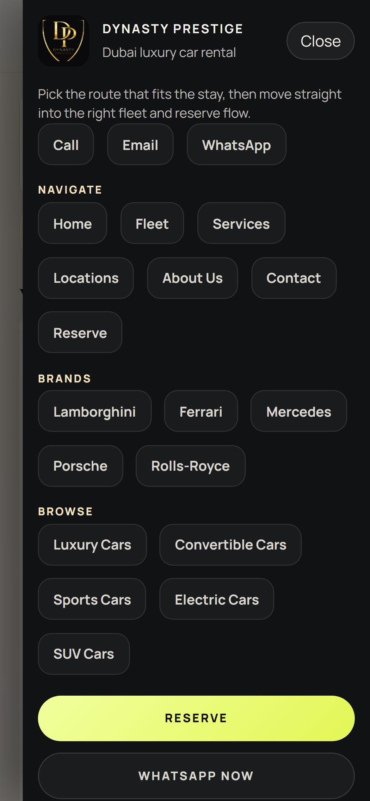

# Bugs visuales y funcionales con capturas

Fecha de corte: 2026-04-21

Objetivo: cada bug queda asociado a una captura estable para poder arreglarlo, comparar el antes/despues y decidir si la solucion queda visualmente bonita, no solo tecnicamente correcta.

## Carpeta de capturas

Capturas congeladas:

`docs/audit/screenshots/visual-bugs-2026-04-21/`

Estas imagenes son copias de los artefactos originales de `artifacts/`, para que no se pierda la evidencia si se limpian runs antiguos.

## Regla nueva: fallo con screenshot obligatorio

Desde esta iteracion, los auditores generan una carpeta de revision humana dentro de cada run:

- Visual: `artifacts/visual-agent/<run>/human-review/visual-findings/`
- Funcional: `artifacts/functional-agent/<run>/human-review/functional-failures/`

Cada carpeta incluye un `manifest.json` con:

- ruta
- viewport
- categoria del fallo
- mensaje
- evidencia
- screenshot original
- screenshot copiado para revision humana

Si el auditor no puede copiar una captura, el manifest lo marca como `screenshotMissing: true`. Ese caso debe tratarse como fallo de auditoria, porque deja el bug sin evidencia visual revisable.

## Resumen ejecutivo

| ID | Estado | Superficie | Severidad | Problema |
| --- | --- | --- | --- | --- |
| BUG-001 | Corregido y verificado | Reserve movil | Alta | La reserva aceptaba una fecha pasada llegada por URL/session. |
| BUG-002 | Corregido y verificado | Reserve movil | Alta | Header de reserva no cumple el contrato canonico de header. |
| BUG-003 | Corregido y baseline aprobada | Reserve movil | Alta | La captura actual diverge mucho del baseline aprobado. |
| BUG-004 | Corregido y verificado | Fleet movil | Alta | Las CTAs Call/WhatsApp dominan las cards y se repite en 6 vehiculos. |
| BUG-005 | Corregido y verificado | Fleet movil | Alta | El auditor detecta contraste debil en textos clave del primer scroll. |
| BUG-006 | Corregido funcionalmente, pulido parcial | Reserve movil | Alta original | El hamburger no abria visualmente el drawer; ahora pasa y el icono ya contrasta en header claro. |

## BUG-001: fecha de reserva pasada

Estado: corregido y verificado.

Fallo detectado: al abrir reserva con `startDate=2026-04-20` el dia real `2026-04-21`, el campo "Delivery Date" quedaba prellenado con una fecha pasada.

Captura antes:


Captura despues del probe:



Evidencia del auditor:

`value=2026-04-20; today=2026-04-21; pastDays=1`

Criterio de salida:

- Un `startDate` pasado por URL/session se corrige a hoy o futuro.
- `input#startDate.min` debe ser como minimo la fecha actual.
- `input#endDate.min` debe ser como minimo la fecha de entrega.
- `date_currentness` no debe aparecer en `npm run test:visual` ni en `agent:visual`.

Verificacion actual:

- `npm run test:visual` pasa.
- Run visual posterior: `artifacts/visual-agent/2026-04-21T12-09-07-032Z`
- Sin findings `date_currentness`.

## BUG-002: header no canonico en Reserve movil

Estado: corregido y verificado.

Fallo detectado: la pagina de reserva rompe el contrato de header. El auditor esperaba `lab_mega_utility`, pero encontro `lab_mega`; ademas la fuente de marca sale como `system-ui` cuando el contrato espera `manrope`.

Captura:



Evidencia del auditor:

`headerVariant=lab_mega expected=lab_mega_utility; headerBrandFontFamily=system-ui expected=manrope`

Riesgo UX:

- El cliente percibe que reserva pertenece a otra familia visual.
- La navegacion movil puede sentirse distinta entre paginas criticas.
- El header ocupa presencia visual sin encajar con el sistema canonico.

Criterio de salida:

- Reserve debe usar el mismo header canonico que Home para su familia.
- Marca, fuente, espaciado, menu movil y CTA deben coincidir con el contrato.
- El auditor debe dejar de emitir `header_consistency`.

Verificacion actual:

- `node scripts/run-visual-agent.js --route /app/reserve/page.html --viewport mobile-modern --no-fleet-clicks --output-dir artifacts/visual-agent/manual-mobile-after-baseline`
- `headerVariant=lab_mega`, aceptado para movil porque Home tambien oculta la utility row en este viewport.
- `headerBrandFontFamily=manrope`.
- Sin finding `header_consistency`.

## BUG-003: Reserve movil diverge del baseline aprobado

Estado: corregido y baseline aprobada.

Captura actual:



Diff contra baseline:



Evidencia del auditor:

`Mismatch ratio 0.183505 against threshold 0.015000`

Lectura humana:

- La pantalla aparece en paso 2 con datos de guest ya rellenados durante el escenario humano.
- Hay un ghost visual arriba: se alcanza a leer `Reservation.` detras del header.
- La composicion movil es legible, pero tiene mucha escala en formularios y el header tapa/compite con contenido superior.

Criterio de salida:

- Si el nuevo diseno es correcto, primero arreglar header/solapamiento y luego actualizar baseline.
- Si el baseline era el correcto, volver la pantalla al ritmo anterior.
- El diff debe bajar por debajo del umbral o actualizarse con aprobacion explicita.

Verificacion actual:

- El auditor limpia `dynastyBookingIntent` antes del screenshot final para no capturar estados humanos mutados.
- Baseline movil de Reserve actualizada en `tests/visual-baselines/app-reserve-page-html/mobile-modern/`.
- Run posterior: `artifacts/visual-agent/manual-mobile-after-baseline`
- Resultado: `good=2 review=0 bad=0` para Reserve/Fleet mobile-modern.

## BUG-004: CTAs de contacto dominan las cards de Fleet movil

Estado: corregido y verificado.

Captura:



Evidencia del auditor:

`affectedCards=6; examples=Huracan EVO Spyder, 296 GTS, 992 GT3, Urus Sport; maxSecondaryButtonWidthRatio=0.994; max=0.94`

`minInlinePaddingPx=1.00; min=12`

Lectura humana:

- El problema es de componente, no de una card suelta.
- Call y WhatsApp casi ocupan el ancho completo de la card.
- Los botones tocan practicamente el borde interno.
- La jerarquia se invierte: la accion secundaria compite con el nombre, precio y CTA principal Reserve.

Criterio estetico:

- Reserve debe ser la accion principal.
- Call/WhatsApp deben ser soporte, no bloque dominante.
- En movil pueden ser stacked, pero con padding interno claro y menor peso visual.
- Mantener labels centradas, altura igual y espacio suficiente.

Criterio de salida:

- `secondaryMaxButtonWidthRatio <= 0.94`
- `secondaryInlinePaddingPx >= 12`
- Sin findings `cta_hierarchy` ni `spacing` para mobile card actions.

Verificacion actual:

- Las CTAs secundarias quedan contenidas dentro del padding de la card y en una columna en movil.
- Run posterior: `artifacts/visual-agent/manual-fleet-mobile-after-fixes`
- Sin findings `cta_hierarchy` ni `spacing`.

## BUG-005: contraste debil en Fleet movil

Estado: corregido y verificado.

Captura:



Evidencia del auditor:

- `Choose dates first... contrastRatio=1.11; requiredRatio=4.5`
- `6 MODELS VISIBLE contrastRatio=2.35; requiredRatio=4.5`
- Texto descriptivo de la coleccion: `contrastRatio=2.35; requiredRatio=4.5`

Lectura humana:

- En la captura el texto principal se ve, pero hay zonas donde el detector esta mezclando fondo efectivo oscuro con texto oscuro.
- Esto puede ser un bug real de contraste o un caso donde el detector necesita acotar mejor el fondo efectivo.
- Antes de cambiar estilos, validar manualmente en viewport movil real y en screenshot del region/viewport.

Criterio de salida:

- Los textos informativos deben superar contraste minimo.
- Si el estilo se ve bien y el problema es medicion, ajustar detector para medir contra el panel real.
- El auditor no debe quedarse con falsos positivos recurrentes.

Verificacion actual:

- Fleet declara fondos claros reales (`background-color`) donde antes solo habia gradientes.
- El auditor ya ignora controles off-canvas cerrados y mide fondos efectivos de superficies con gradiente.
- El boton movil `Filters` y las CTAs doradas usan texto oscuro para contraste real.
- Run posterior: `artifacts/visual-agent/manual-fleet-mobile-after-fixes`
- Sin findings `contrast`.

## BUG-006: drawer movil de Reserve

Estado: corregido funcionalmente, pulido parcial.

Captura del fallo original:


Captura actual del drawer abierto:



Evidencia original:

`Button did not visibly toggle its controlled region (lab-mobile-drawer).`

Verificacion actual:

`npm run audit:customer:journeys -- --route /app/reserve/page.html --viewport mobile-modern`

Resultado:

`failedActions=0`

Lectura humana:

- Funcionalmente ya abre.
- El icono hamburger en Reserve ya contrasta contra el header claro.
- El drawer abierto sigue siendo una zona candidata a pulido visual posterior: muchos chips grandes, fondo oscuro, CTA Reserve amarillo muy dominante y WhatsApp Now enorme.
- Si el header canonico va a ser mas limpio, conviene pulir tambien el drawer para que no parezca una pagina aparte.

Criterio de salida estetico:

- Drawer abre/cierra con claridad.
- Las acciones se agrupan por prioridad: navegar, marcas, tipos, contacto.
- Reserve principal puede destacar, pero no debe romper el equilibrio visual.
- El menu debe sentirse parte del header canonico, no un bloque legacy.

## Orden recomendado de arreglo

1. Backlog visual-smoke global: Home, Contact, Services mobile-short/tablet y PDPs siguen generando hallazgos en `npm run audit`.
2. BUG-006: pulido estetico completo del drawer movil, ya que funcionalmente pasa.
3. Revisar y aprobar baselines restantes solo despues de arreglar cada superficie.

## Comandos de validacion

Visual unitario:

```bash
npm run test:visual
```

Reserva movil:

```bash
node scripts/run-visual-agent.js --route /app/reserve/page.html --viewport mobile-modern --no-fleet-clicks
```

Fleet movil:

```bash
node scripts/run-visual-agent.js --route /fleet.html --viewport mobile-modern --no-fleet-clicks
```

Journey movil de reserva:

```bash
npm run audit:customer:journeys -- --route /app/reserve/page.html --viewport mobile-modern
```
